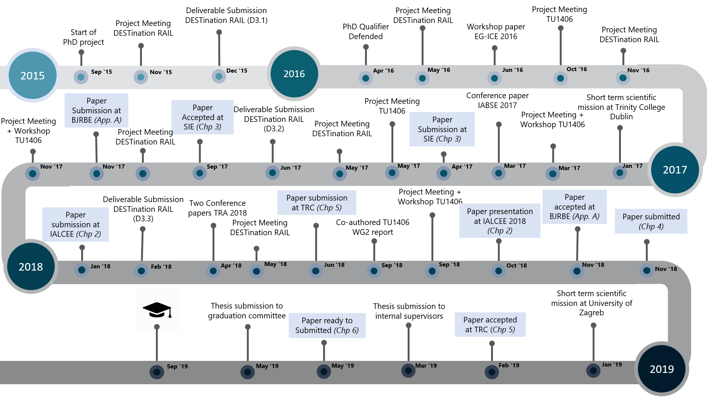

<h3> Providing decision support for transport infrastructure maintenance planning: Through application of multi-criteria and machine learning methods  </h3>
Transportation agencies are facing competing demands to optimally spend the limited budget and satisfy various performance requirements related to reliability of assets, safety of users, availability of the network and impact on the environment. The multiple performance requirements of infrastructure give rise to several decision-making dilemmas.

Aligned within the focus of two European projects, namely <a href="http://www.destinationrail.eu/"> DESTination RAIL </a> and <a href = "https://www.tu1406.eu/"> COST ACTION TU1406</a>, the objective of this research is <u> to improve the decision-making process of maintenance planning by developing applied decision support methods and predictive models to aid transport infrastructure managers</u>. 

The research iteratively applied the design cycle consisting of problem investigation, treatment design, and treatment validation as shown below:  

The following figure provides a schematical overview of all the research activities conducted during the four-years PhD trajectory.

The full thesis is available at: <a href="https://ris.utwente.nl/ws/portalfiles/portal/135617164/534435_zaharah_final.pdf"> PhD Thesis </a>
Access the thesis in flipbook format at: <a href="https://books.ipskampprinting.nl/thesis/534435-zaharah/"> Thesis Flipbook </a>
Request a hard-copy of thesis by sending email at: zaharahbukhsh@gmail.com
